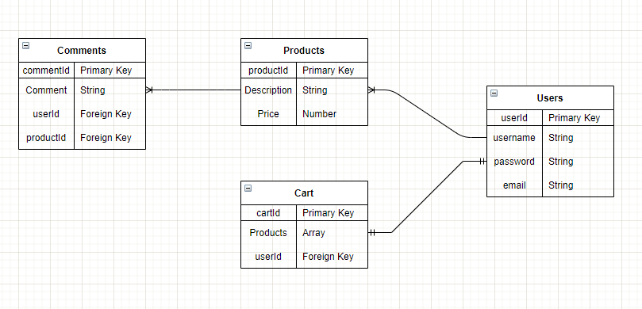

# Gregslist

## Date: 10/11/2021

#### By: Ryan Craig

[Git](https://github.com/Rpcraig123/Gregslist) | [Trello](https://trello.com/b/fUZgCLGL/gregslist)

---

**_Description_**

An ecommerce site for people to sell their belongings.

---

**_Technologies Used_**

- MongoDB
- Express
- React
- React Redux
- Node
- Heroku
- Material-UI
- OAuth

---

**_Component Heirarchy Diagram_**

---

**_Entity Relationship diagram_**

---

**_Future Updates_**

- [ ] Build the database and learn how to autopopulate info with the user that is currently signed in.
- [ ] Build backend routes and test.
- [ ] Design and build front end .
- [ ] Build and test front end routes.
- [ ] Incorporate OAuth.
- [ ] Incorporate material UI components.
- [ ] Custom CSS.
- [ ] UX Improvements.
- [ ] Look into Mapbox features.
- [ ] Optimize and clean code.
- [ ] Deploy on heroku.

---

