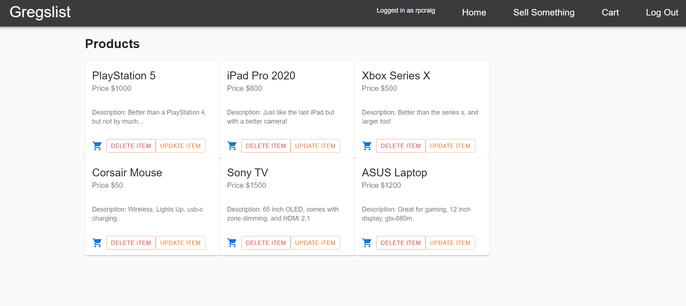

# Gregslist

## Date: 10/11/2021

#### By: Ryan Craig

[Git](https://github.com/Rpcraig123/Gregslist) | [Trello](https://trello.com/b/fUZgCLGL/gregslist)

---

**_Description_**

An ecommerce site for people to sell their belongings. Built using react-redux.

---

**_Getting Started_**

Click on the link at the top of the ReadMe that says "Deployement Link". After you are redirected, you can create an account, then sign in and start exploring Gregslist.

---

**_Technologies Used_**

- MongoDB
- Express
- React
- React Redux
- Node
- Heroku
- Material-UI

---

**_Future Updates_**

- [ ] Will eventually allow the user to add a picture of the product they are selling.
- [ ] OAuth incorporation.
- [ ] Update the design.
- [ ] Make the styling compatible with mobile display sizes.
- [ ] Incorporate a pick up function that will use the geolocation of the seller to arrange a pickup for the product.
- [ ] UX Improvements, specifically modals to help direct the user.
- [ ] Updates to the comment section that will include the user that posted the comment.

---

